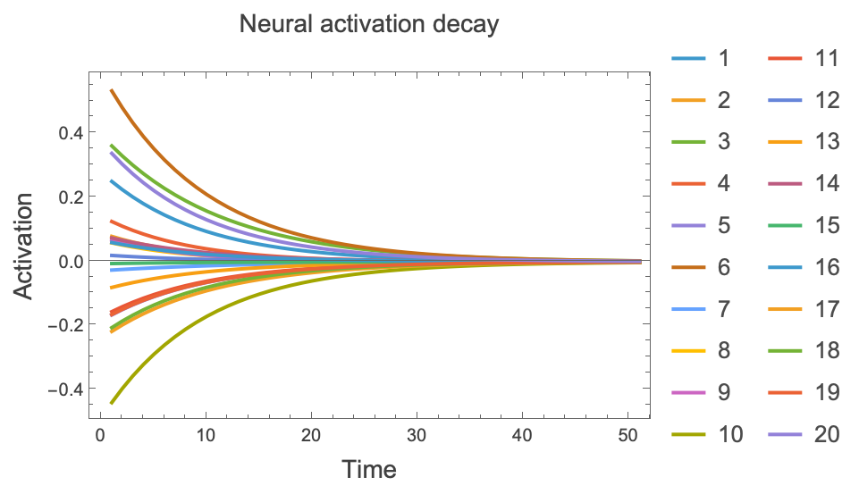
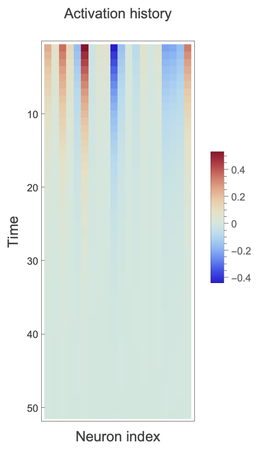
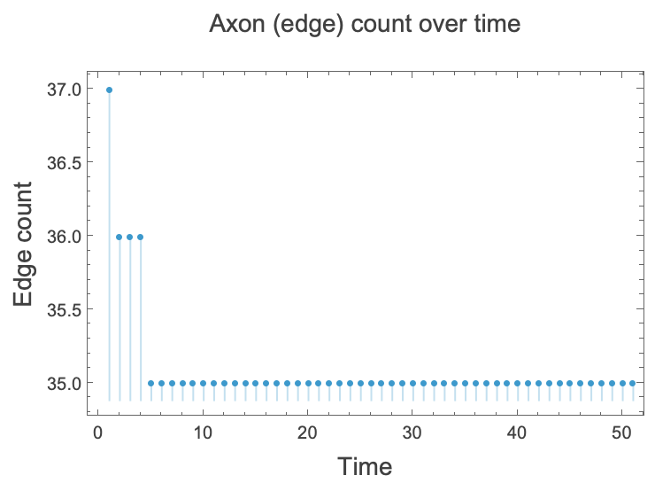
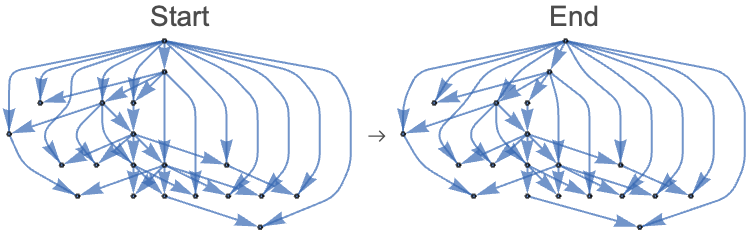
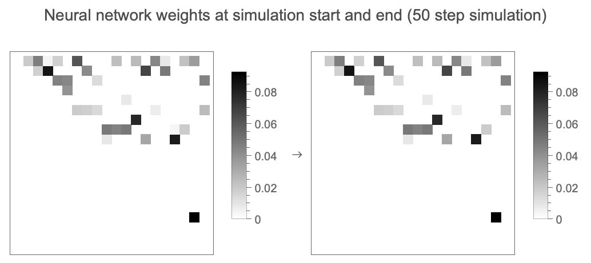

# Experiment 1: Silence

**System Dynamics Matrix**: Input=0, Reward=0

## Experimental Parameters
*   **Input**: 0 (Silence)
*   **Reward**: 0
*   **LeakRate**: 0.1
*   **SurvivalThreshold**: 0.005
*   **Steps**: 50

## Hypotheses
### Testable bullets
*   Weights don't change unless their corresponding edge is pruned or a new edge is sprouted.
*   Activations leak to zero at the specified LeakRate.
*   Edges with weights under the SurvivalThreshold are pruned.
*   Sprouting is active, but unlikely due to the rarity of candidate correlations to turn into edges.

### Description
If I feed the brain no sensory input and no reward, the existing weights do not undergo Hebbian learning, but the metabolism continues to run, so neuron activations leak at the specified LeakRate; meanwhile, edges under the SurvivalThreshold are pruned, and vertices whose residual activations correlate will sprout new connections with tiny pioneer weights at the specified SproutingRate within the MaxDensity capacity.

## Setup
We initialize a random directed Barabasi-Albert graph. This gives us a scale-free structure to start with.
(See `experiment.wl` for initialization code)

## Simulation
Run for 50 steps with standard LeakRate (0.1).

## Analysis

### Activations
**Question**: In this scenario, how did the activations change over time?

We can also visualise the evolution of neural activations as a spacetime plot:

**Answer**: We expected that activations would leak to zero, and they did.

### Edges
**Question**: How did the number of edges change over time?

**Answer**: The edge count dropped from 37 to 35 between step 1 and 5. There were no further changes throughout the simulation run. We expected that new axons would be unlikely to grow, and that existing weak edges would be pruned. This time series plot is consistent with that assessment.

### Network structure
**Question**: How did the network structure change over time?

**First and last state network comparison:**

**Answer**: At step one, two edges are pruned, and one is sprouted. At step 4, one more edge is pruned. There are no further changes to the structure of the graph in this simulation. This is consistent with our expectation that the pruning and sprouting mechanisms are active and will fire if the starting graph configuration permits it. The first starting network differs from the final graph by only two edges.

### Weights
**Question**: How did the weights evolve throughout the simulation?

**First and last state weight comparison:**

**Answer**: We expected that weights should only change as a result of the pruning and sprouting processes. Visual inspection shows this appears to be the case. The weights only changed in the first five steps. They are otherwise static throughout the simulation.

## Conclusion & Verification
### Claim 1: Activations leak to zero
[PASS] Claim 1: Activations leaked to zero.

### Claim 2: Weights are very stable overall
[PASS] Claim 2: Weights did not grow.

### Claim 3: Sprouting finds no correlations
[PASS] Claim 3: Topology did not grow.

**[CONCLUSION] Hypothesis Behavior CONFIRMED (Metabolic decay).**
