# Experiment 2: Pure Reinforcement

**System Dynamics Matrix**: Input=0, Reward=1

## Hypotheses
### Testable bullets
*   Weights will reinforce along internal loops, tending towards saturation.
*   Neural activations amplify.
*   Edges sprout to support these self-generated echoes, crowding out others.

### Description
If I feed the brain no sensory input but provide high reward, the system faces a bifurcation point. If neural activation decay (LeakRate) dominates, the energy dissipates before self-sustaining loops can form. However, if reinforcement (LearningRate) is strong enough to overcome this decay, internal echoes will amplify and the neural activations corresponding to nodes along these pathways will saturate. Since the initial state is random noise, the system effectively learns and reinforces that noise.

## Setup
We initialize a random directed Barabasi-Albert graph. This gives us a scale-free structure to start with.
(See `experiment.wl` for initialization code)

## Simulation
We will run two scenarios to demonstrate the variable dynamics.

---

## Scenario A: Metabolic Stability (High Leak, Low Learning)
Run for 50 steps with LeakRate = 0.15 and LearningRate = 0.01.

### Activations
**Question**: In this scenario, how did the activations change over time?

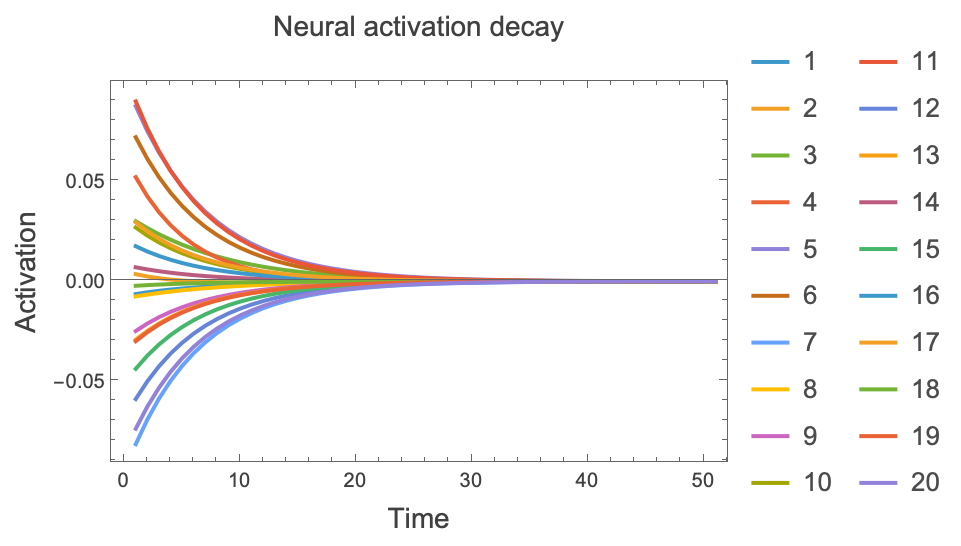

We can also visualise the evolution of neural activations as a spacetime plot:

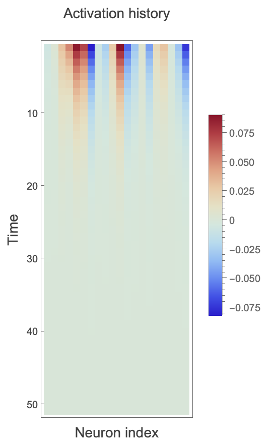

**Answer**: The activations all decayed towards zero.

### Network structure
**Question**: How did the network structure change over time?

**First and last state network comparison:**
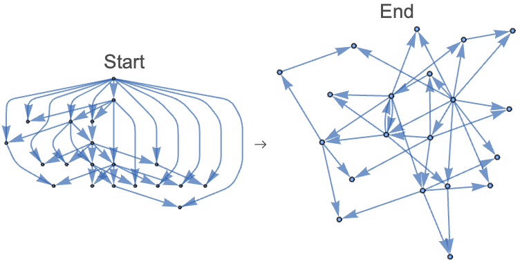

**Answer**: At step 1, one edge is pruned, and one sprouted. At step 2, one more is sprouted, and at step 7, one more is pruned. Overall, it takes pruning one edge and sprouting another to go from the starting network to the final network.

### Edges
**Question**: How did the number of edges change over time?

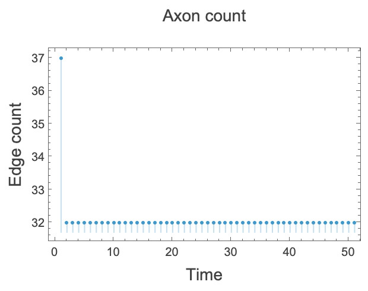

**Answer**: The edge count grew by one at step 3 and dropped by one at step 8. There were no further changes to the network's structure throughout the simulation run. The edge count is overall very stable throughout the simulation.

### Weights
**Question**: How did the weights evolve throughout the simulation?

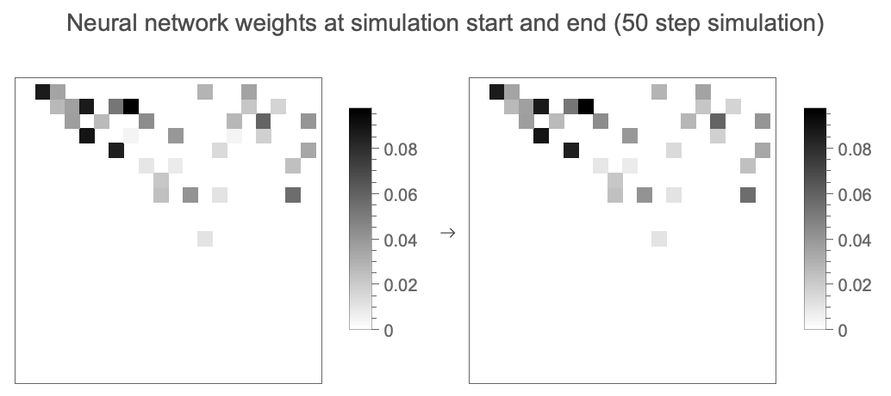

**Answer**: The weights only changed in the first step as a consequence of edge pruning. They are static throughout the simulation.

---

## Scenario B: Runaway Reinforcement (Low Leak, High Learning)
Run for 50 steps with LeakRate = 0.05 and LearningRate = 0.2.

### Activations
**Question**: In this scenario, how did the activations change over time?

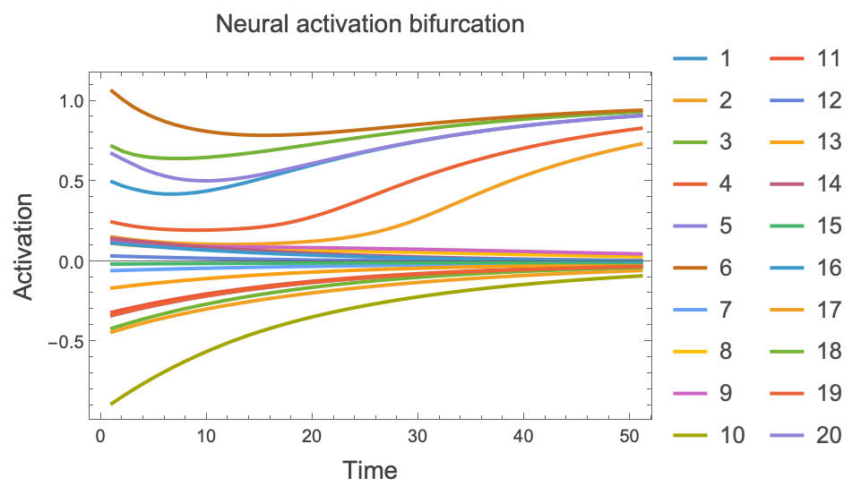

We can also visualise the evolution of neural activations as a spacetime plot:

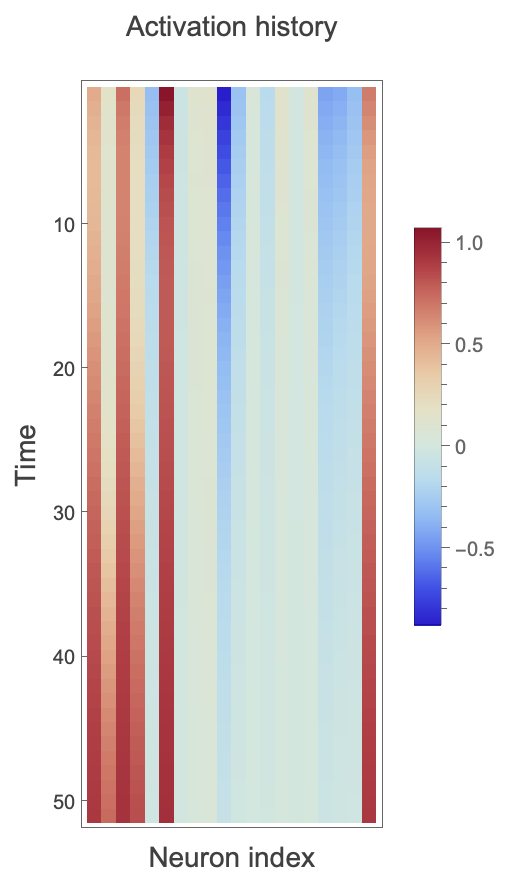

**Answer**: For some neurons, the activations decayed to zero, while for others, activations saturated. This is consistent with our expectation that if reinforcement (LearningRate) overcomes activations decay (LeakRate), activations will amplify along the strongest existing feedback pathways.

### Network structure
**Question**: How did the network structure change over time?

**First and last state network comparison:**
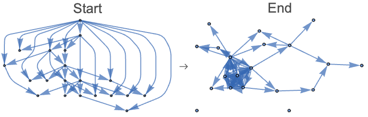

**Answer**: The network structure evolved strong feedback loops. Edges that participate in self-reinforcing loops are strengthened and preserved, while edges that do not contribute to these active pathways are pruned away. Crucially, new edges sprouted to bridge gaps and reinforce these emergent loops, leading to a denser topology centered on the active pathways.

### Edges (axons)
**Question**: How did the number of edges change over time?

**Answer**: The edge count grew by from 37 to 51 from step 4 to 25. The ascent is punctuated with small dips from steps 11 to 12 and 16 to 18. Between step 30 to 50, the edge count seems to stabilize at 49.

### Weights
**Question**: How did the weights evolve throughout the simulation?

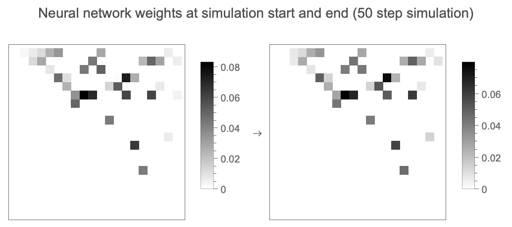

**Answer**: Weights reinforced along active paths, leading to saturation. Weaker weights were pruned.

---

## Comparison

### Activations
Compare activation time series:
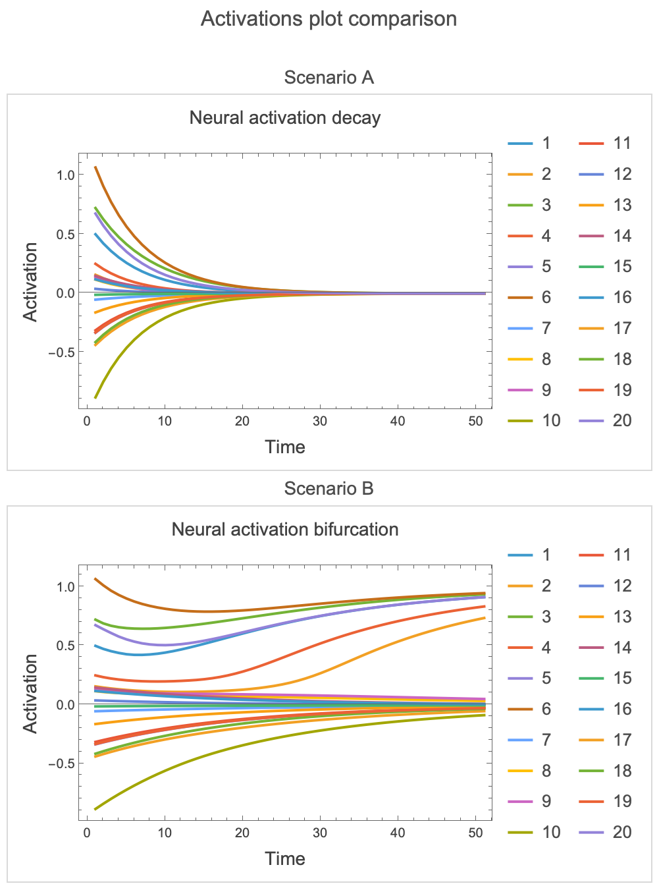

Compare rasters:
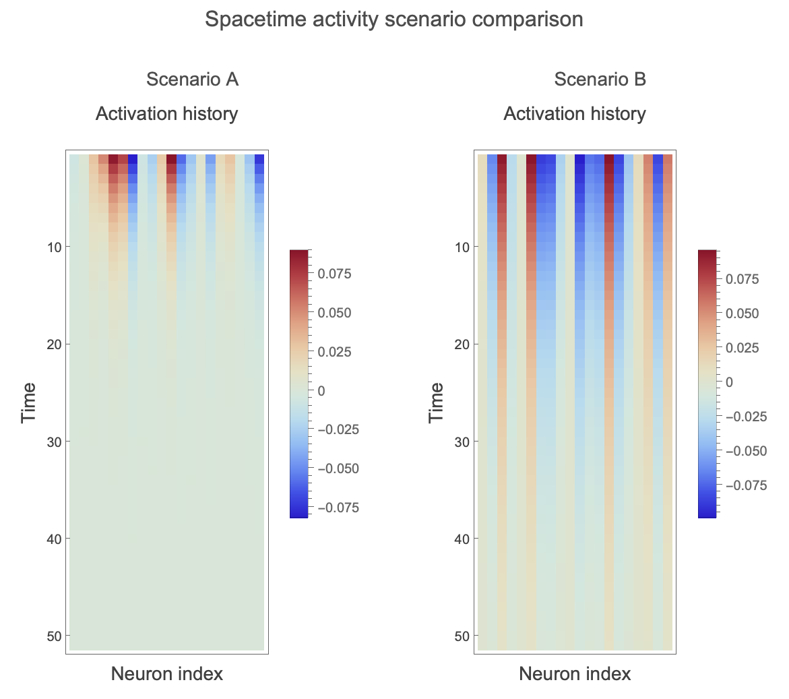

### Edges
Compare edge plots:
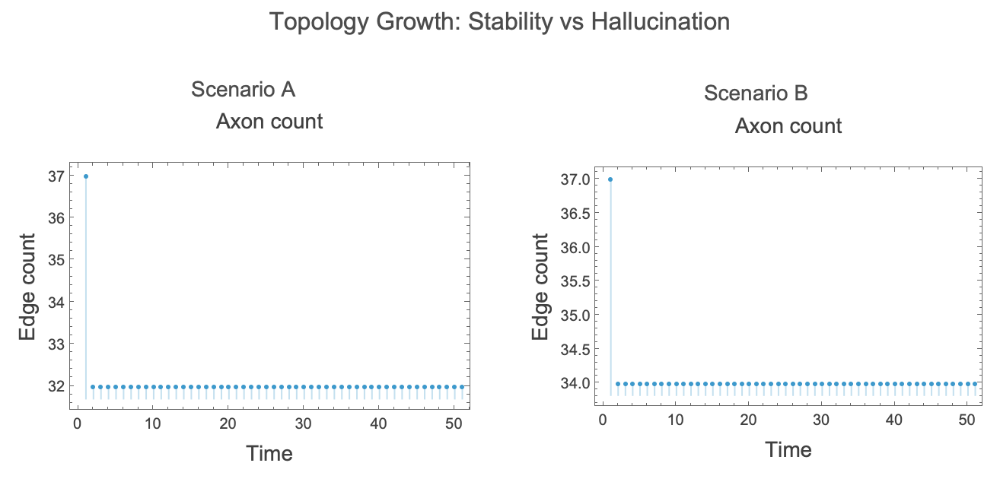

### Weights
Compare weights:
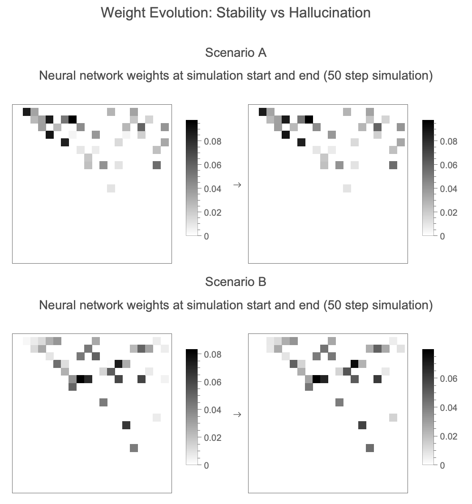

---

## Conclusion

We want to confirm the our bifurcation hypothesis.

1.  **Stability (Scenario A)**: The system should dissipate energy. Final activation < Initial activation.
2.  **Runaway Reinforcement (Scenario B)**: The system should trap and amplify energy. Significant portion of neurons (> 15%) should saturate/max out.

### Verification of specific claims

*   **Scenario A: Metabolic Stability**
    *   We check if the mean activation has decayed relative to the initial state.
    *   [PASS] Scenario A: System correctly dissipated energy (Decay observed).

*   **Scenario B: Runaway Reinforcement**
    *   We check if a significant portion of neurons (> 15%) have saturated (activation > 0.9).
    *   *The threshold (> 15%) is chosen to detect the subset of neurons that have fully saturated (> 0.9) within the 50-step window. Visual inspection of time-series shows a larger portion of the network is recruiting (rising activation) but has not yet crossed the saturation threshold.*
    *   [PASS] Scenario B: System correctly entered self-reinforcing state (Runaway Reinforcement observed).

**[CONCLUSION] Hypothesis CONFIRMED: Dynamics show clear bifurcation between Stability and Runaway Reinforcement.**
