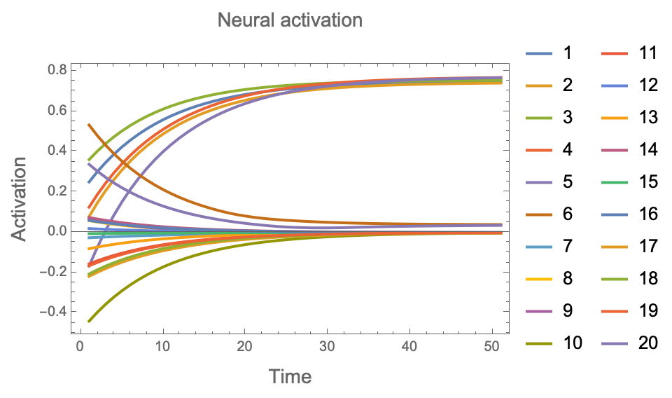
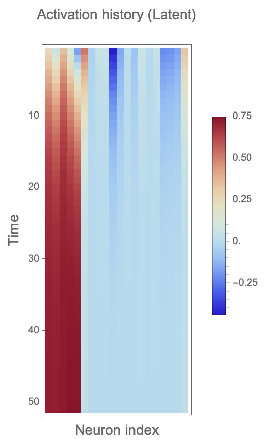
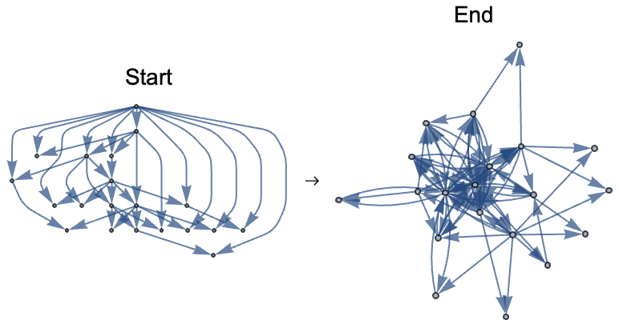
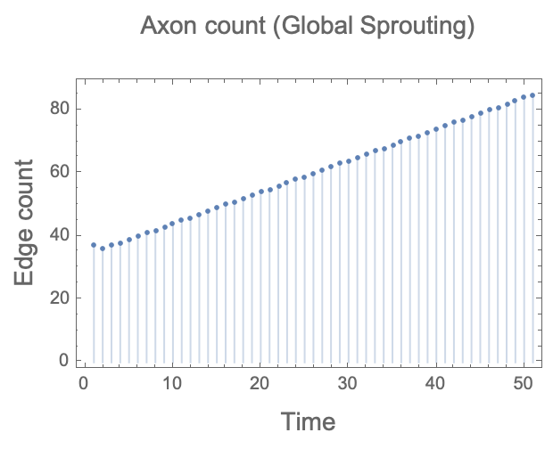
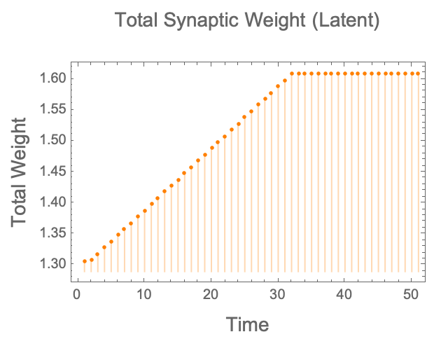

# Experiment 3: Latent Learning

**System Dynamics Matrix**: Input=1 (Constant), Reward=0

## Hypotheses
### Testable bullets
*   Activations saturate globally (Tanh limit ~0.76).
*   Weights don't change (Hebbian learning inactive).
*   Edges sprout globally ($P > \tau$) resulting in a dense, interconnected mesh.

### Description
"If I feed the brain a constant global input but no reward, Hebbian learning is inactive, so weights don't change; however, the Potentiality Matrix will reflect the global correlations of the driven activations; if these exceed the threshold, edges will sprout to connect the nodes indiscriminately, resulting in a dense, random web of pioneer connections."

## Setup
We initialize a random directed Barabasi-Albert graph. This gives us a scale-free structure to start with.
(See `experiment.wl` for initialization code)

## Simulation
Run for 50 steps.
- **LeakRate**: 0.1
- **SproutingThreshold**: 0.01
- **WeightAssignmentFunction**: 0.01 (Pioneers)

## Analysis

### Activations
**Question**: In this scenario, how did the activations change over time?

We can also visualise this as a time series:

**Answer**: The activations saturated globally, stabilizing around 0.76. This corresponds to Tanh[1.0] (Input=1), as the latent weights are too weak to amplify the signal further. The network is "lighting up" entirely, limited only by the input magnitude.

### Network structure
**Question**: How did the network structure change over time?

**First and last state network comparison:**

**Answer**: The network became extremely dense. Because all neurons were active, the correlation condition ($P > \tau$) was met for almost every pair of nodes, leading to massive sprouting. The graph effectively transitions toward a complete graph (clique).

### Edges
**Question**: How did the number of edges change over time?

**Answer**: The edge count skyrocketed until it hit the MaxDensity limit or saturated the graph. This demonstrates "Global Latent Learning" - the topology reflects the global correlation of the input.

### Weights
**Question**: How did the weights evolve throughout the simulation?

**Answer**: Total synaptic weight increased due to the sheer number of new edges, but individual edge weights remained at the pioneer level. The "mass" of the brain increased, but the "strength" of individual connections did not traverse the Hebbian learning curve.

## Conclusion & Verification

### Claim 1: Activations saturate globally
[PASS] Claim 1: Activations saturated globally (Tanh limit).

### Claim 2: Weights don't change (Hebbian learning inactive)
[PASS] Claim 2: Weights remained latent/pioneer (Individual weights low).

### Claim 3: Edges sprout globally
[PASS] Claim 3: Topology grew significantly (Global Sprouting).

**[CONCLUSION] Hypothesis CONFIRMED: Global Latent Learning observed.**
