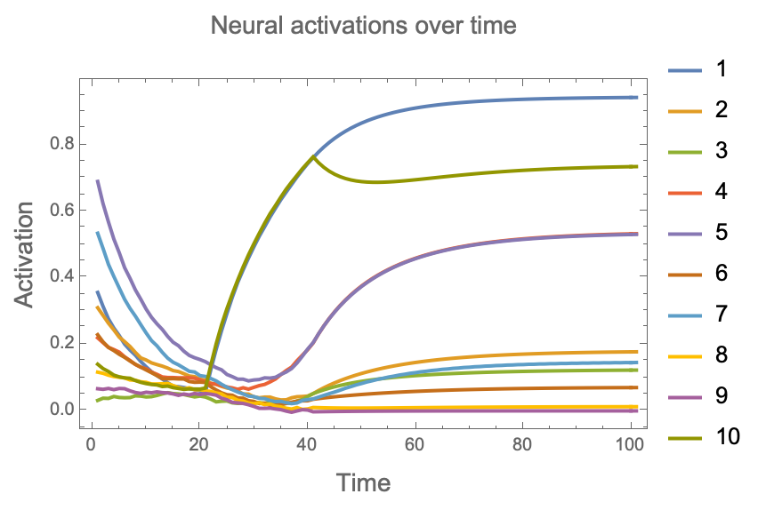
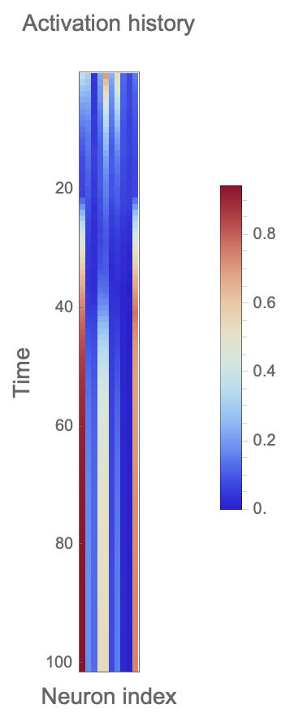
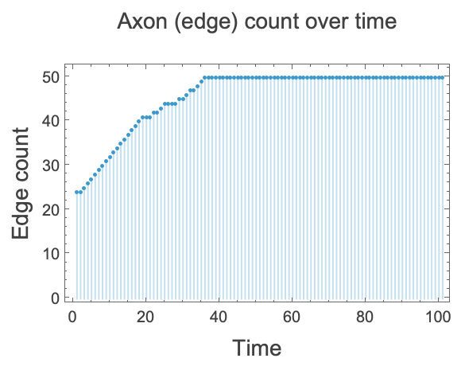
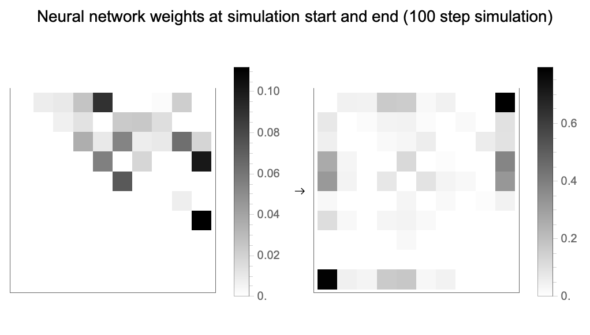
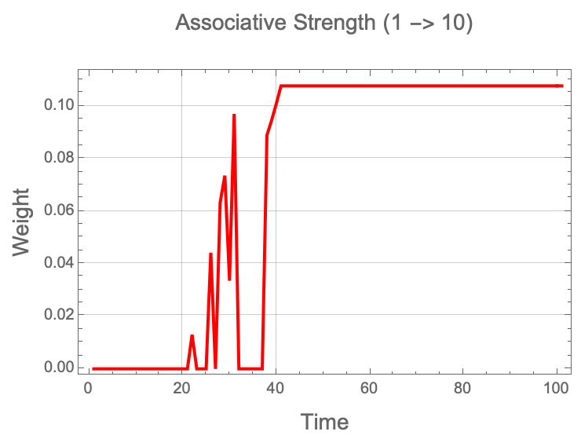
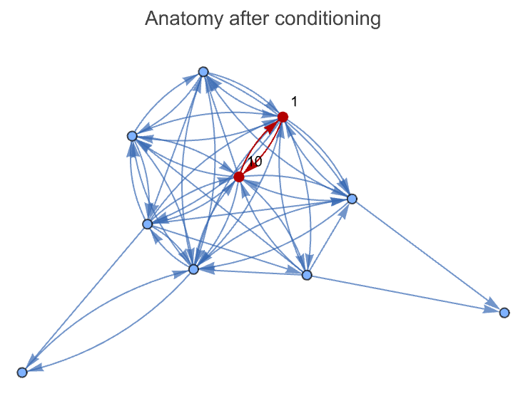
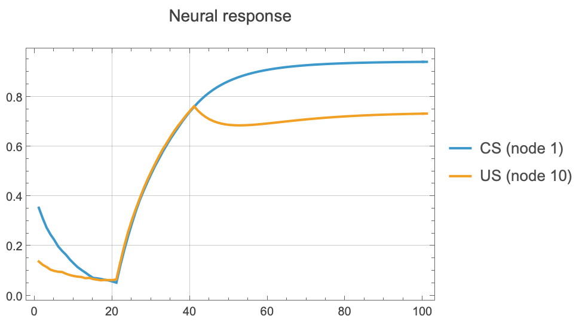

# Guide: Pavlovian Conditioning

**Objective**: Teach the brain to associate a conditioned stimulus (CS) with an unconditioned stimulus (US) using Hebbian learning.

## The Setup
We create a "lobotomized" brain with 10 neurons where we explicitly remove any direct connection between **Node 1** (CS) and **Node 10** (US).

*   **Network**: 10 Neurons, Scale-Free (BA-Graph).
*   **CS**: Neuron 1.
*   **US**: Neuron 10.
*   **Protocol**: 3-Phase Training.

## Protocol

### Phase 1: Baseline (Steps 1-20)
*   **Input**: Random noise.
*   **Reward**: 0.
*   **Goal**: Establish a baseline of activity. We expect no strong association between Node 1 and Node 10.

### Phase 2: Conditioning (Steps 21-40)
*   **Input**: Simultaneously drive **Node 1** (CS) and **Node 10** (US) with high intensity (1.0).
*   **Reward**: **1.0** (High).
*   **Mechanism**: The co-activation of 1 and 10 creates a "potentiality" for connection ($P_{1,10} \approx 1$). The high reward activates Hebbian learning, strengthening any new or existing paths between them.

### Phase 3: Testing (Steps 41-100)
*   **Input**: Pulse **Node 1** (CS) *only*.
*   **Reward**: 0.
*   **Test**: Does **Node 10** (US) fire in response? If yes, the brain has learned the association. The response settles to a stable fixed point (approx 0.73) rather than decaying to zero.

## Global Dynamics
Before diving into the specific conditioning results, let's look at the brain's overall behavior.

### Activations
**Question**: How did the activations change over time across the whole network?

The raster plot clearly shows the three phases of the experiment:
1.  **Baseline (Left)**: Activations tend towards zero along noisy trajectories.
2.  **Conditioning (Middle)**: Out of the noise, two horizontal curves shoot up together (CS and US being driven hard). Other neural activations grow as more connections form.
3.  **Testing (Right)**: The CS and US activation lines bifurcate. The CS continues to be driven, while the US fires alongside it but weakens slightly, reaching an apparent fixed point (~0.73).

### Edges
**Question**: How did the connectivity change?

For the first 20 ticks (baseline), the number of edges grows without a discernible pattern. During conditioning (21-40), growth slows as pruning increases, but new edges form more orderly. In the testing phase (41-100), the network enters a limit cycle: pruning one edge to make another, then reversing, oscillating until the end.

### Weights
**Question**: How did the synaptic weights evolve?

Even some of the weights that were initially the strongest weaken and fade throughout the simulation. On the other hand, the matrix becomes more symmetrical. During the conditioning phase, the edges appear, but the CS and US weights really pick up after the end of the conditioning phase.

## Pavlovian Specifics

### Learning Curve
The brain rapidly recruits connections to bridge the gap between the CS and US.

### Anatomy
The final network structure highlights the learned pathway (Direct 1->10 edge or indirect route).

### Response
In the Testing phase (right side), pulsing Node 1 causes a strong response in Node 10 (Orange line), proving the association was learned.

## Conclusion
The brain successfully learned the Pavlovian association. By rewarding the simultaneous firing of the CS and US, the system physically restructured itself (sprouting/strengthening) to encode the causal link, allowing the CS to trigger the US autonomously.
