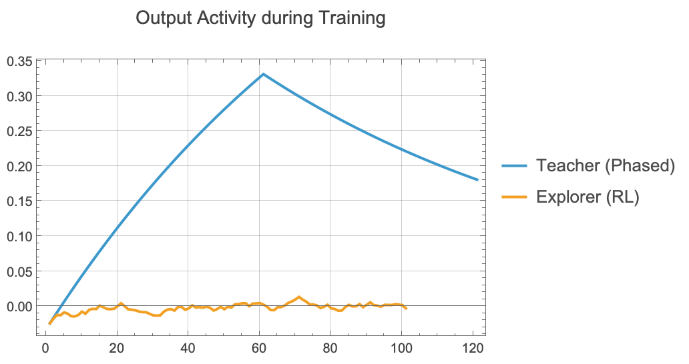
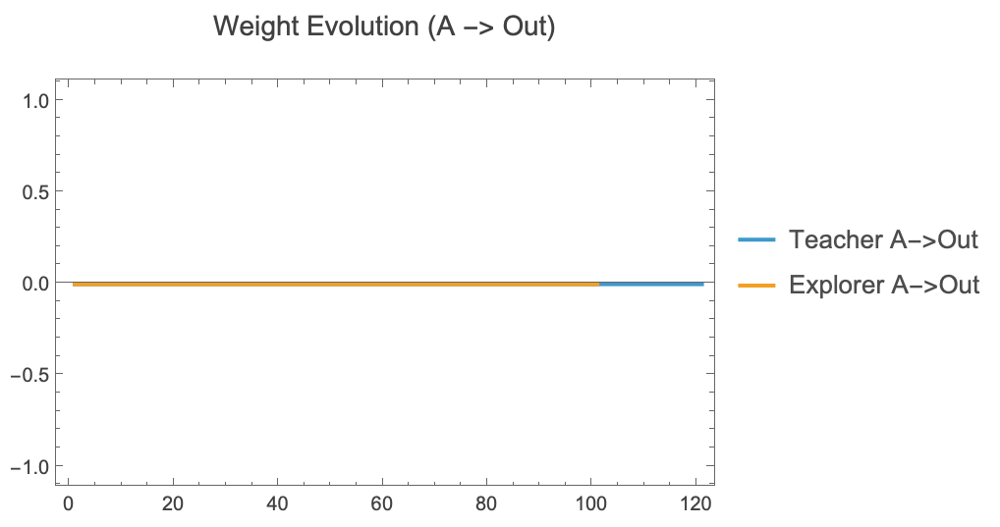

# Guide: Emergent XOR ("Teacher vs Explorer")

**Objective**: Can a standard 10-node neural network learn non-linear XOR logic? We test two competing approaches.

## The Experiment
We clone a single random brain and subject it to two different training regimens.

### Protocol A: "The Teacher" (Phased Training)
A supervised, curated curriculum. We force the network to learn step-by-step.
1.  **Phase A**: Learn A $\to$ Output (+1 Reward).
2.  **Phase B**: Learn B $\to$ Output (+1 Reward).
3.  **Phase AB**: Learn A+B $\to$ Silence (**-5 Reward**).
4.  **Test**: Verify logic.
*   **pros**: Fast, guaranteed signal.
*   **cons**: Artificial.

### Protocol B: "The Explorer" (Evolutionary RL)
A Darwinian gauntlet. We throw the network into a chaotic environment.
*   **Method**: Inputs fire randomly (Noise).
*   **Reward**: The network only gets a "cookie" (+1) if it *spontaneously* matches the truth table. It gets slapped (-5) if it fires on A+B.
*   **pros**: Biologically realistic. "True emergence".
*   **cons**: High risk of failure in short timeframes.

## Specifics

### Comparison Results
We compare the final response of both brains to the 3 logical conditions.
*   **Success**: A>0.5, B>0.5, AB<0.2.

### Learning Curves
**Question**: How does the "Knowledge" accumulate?
*   **Teacher**: Expect sharp, stepped improvements as phases change.
*   **Explorer**: Expect noisy, gradual adaptation (or failure).

### Weight Evolution
**Question**: Do they solve it the same way?
We track the growth of the direct A $\to$ Output connections. In the Explorer, do these connections struggle to form against the noise?

